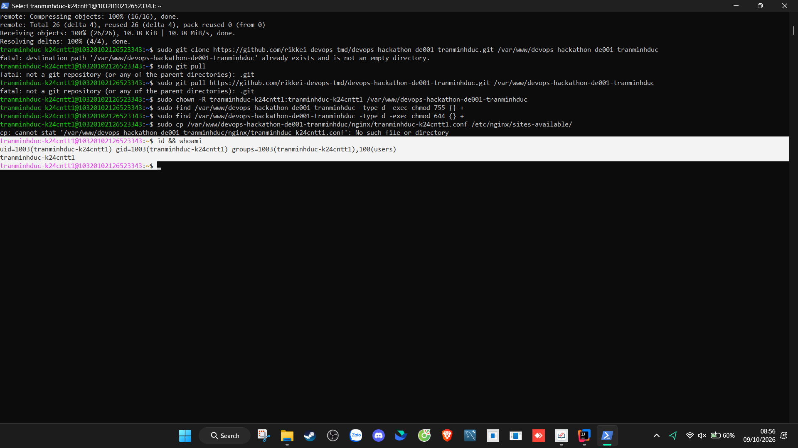
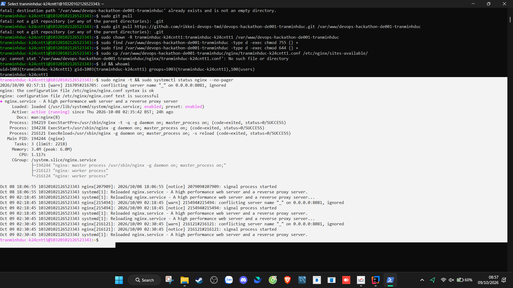
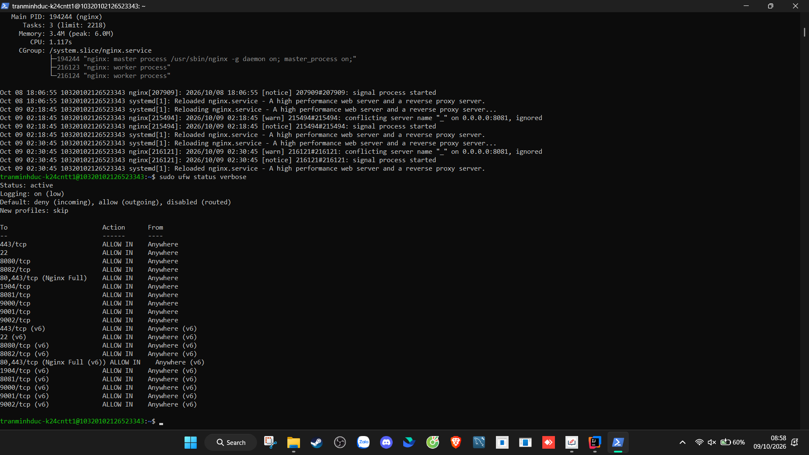

# DevOps Hackathon – Đề 001: Quản lý phòng Lab

## 1. Thông tin sinh viên
| Họ và tên | Mã sinh viên | Lớp | Tài khoản Linux | GitHub | Cổng Nginx |
| :--- | :--- | :--- | :--- | :--- | :--- |
| Trần Minh Đức | K24CNTT1 | K24-CNTT1 | tranminhduc-k24cntt1 | rikkei-devops-tmd | 8088 |

## 2. Môi trường triển khai
- Hệ điều hành: Ubuntu 24.04 LTS (x86_64)
- Phiên bản Nginx: 1.24+ (nginx/1.24.0 Ubuntu)
- Phiên bản Git: 2.43+
- Nơi chạy: VPS Cloud Linux (Địa chỉ IP: 103.20.102.126)

## 3. Cấu trúc dự án
```text
devops-hackathon-de001-tranminhduc/
├── src/
│   └── index.html
├── nginx/
│   └── tranminhduc-k24cntt1.conf
├── screenshots/
│   ├── 01-user.png
│   ├── 02-nginx.png
│   ├── 03-ufw.png
│   ├── 04-website.png
│   ├── 05-git-log.png
│   └── 06-update.png
├── .gitignore
└── README.md
```

## 4. Cấu hình Nginx
| Tham số trong template | Giá trị đã điền | Giải thích |
| :--- | :--- | :--- |
| `<PORT>` | 8088 | Cổng cá nhân phục vụ website qua Nginx (IPv4 & IPv6), tránh xung đột trên server dùng chung |
| `<SERVER_NAME>` | 103.20.102.126 | Địa chỉ IP máy chủ VPS phục vụ request |
| `<WEB_ROOT>` | /var/www/devops-hackathon-de001-tranminhduc/src | Đường dẫn tuyệt đối trỏ vào thư mục mã nguồn web |
| `<INDEX_FILE>` | index.html | Tệp tin trang chủ mặc định được phục vụ |
| `<TEN_TAI_KHOAN>` | tranminhduc-k24cntt1 | Tên tài khoản Linux dùng để đặt tên file nhật ký truy cập (access/error log) |
| `<ALLOW_DIRECTIVE>` | allow all; | Chỉ thị Nginx cho phép mọi truy cập HTTP từ bên ngoài |

## 5. Tường lửa UFW
- Các rule đã cấu hình:
  - `22/tcp` (SSH - cho phép quản trị từ xa an toàn)
  - `8088/tcp` (Nginx - cho phép truy cập website cá nhân từ Internet)
- Kết quả kiểm tra lệnh `sudo ufw status verbose`:
```text
Status: active
Logging: on (low)
Default: deny (incoming), allow (outgoing), disabled (routed)
New profiles: skip

To                         Action      From
--                         ------      ----
22/tcp                     ALLOW IN    Anywhere                  
8088/tcp                   ALLOW IN    Anywhere                  
22/tcp (v6)                ALLOW IN    Anywhere (v6)             
8088/tcp (v6)              ALLOW IN    Anywhere (v6)             
```

## 6. Các bước triển khai
1. **Khởi tạo người dùng**: `sudo adduser tranminhduc-k24cntt1` và cấp quyền quản trị: `sudo usermod -aG sudo tranminhduc-k24cntt1`.
2. **Cài đặt gói phần mềm**: `sudo apt update && sudo apt install -y nginx git ufw curl`.
3. **Cấu hình Git danh tính**: `git config --global user.name "Tran Minh Duc"` và `git config --global user.email "tranminhduc@example.com"`.
4. **Clone mã nguồn từ GitHub**: `sudo git clone https://github.com/rikkei-devops-tmd/devops-hackathon-de001-tranminhduc.git /var/www/devops-hackathon-de001-tranminhduc`.
5. **Phân quyền chuẩn**: `sudo chown -R tranminhduc-k24cntt1:tranminhduc-k24cntt1 /var/www/devops-hackathon-de001-tranminhduc`, cấp quyền thư mục `755` và tệp tin `644`.
6. **Kích hoạt Server Block Nginx**:
   - `sudo cp /var/www/devops-hackathon-de001-tranminhduc/nginx/tranminhduc-k24cntt1.conf /etc/nginx/sites-available/`
   - `sudo ln -s /etc/nginx/sites-available/tranminhduc-k24cntt1.conf /etc/nginx/sites-enabled/`
   - `sudo rm -f /etc/nginx/sites-enabled/default`
7. **Kiểm tra và tải lại Nginx**: `sudo nginx -t && sudo systemctl reload nginx`.
8. **Thiết lập tường lửa UFW**: `sudo ufw allow 22/tcp && sudo ufw allow 8088/tcp && sudo ufw --force enable`.

## 7. Kiểm tra & minh chứng
- **01-user.png**: Kết quả lệnh `id` và `whoami` của tài khoản `tranminhduc-k24cntt1`.


- **02-nginx.png**: Kết quả `sudo nginx -t` và `sudo systemctl status nginx` (active, enabled).


- **03-ufw.png**: Kết quả `sudo ufw status verbose` thể hiện mở cổng 8088.


- **04-website.png**: Trình duyệt mở `http://103.20.102.126:8088` hiển thị trang web sinh viên.


- **05-git-log.png**: Lịch sử commit `git log --oneline` thể hiện đủ các commit rõ ràng.


- **06-update.png**: Giao diện website sau khi cập nhật nội dung lần 2.


## 8. Quy trình cập nhật website
1. **Trên máy tính cá nhân**: Chỉnh sửa file `src/index.html` (thêm thông tin Cập nhật lần 2).
2. **Commit và đẩy lên GitHub**:
   ```bash
   git add src/index.html
   git commit -m "feat: Cap nhat noi dung website lan 2"
   git push origin main
   ```
3. **Trên máy chủ Linux**: Di chuyển vào thư mục dự án và kéo mã nguồn mới:
   ```bash
   cd /var/www/devops-hackathon-de001-tranminhduc
   git pull origin main
   ```
4. **Nghiệm thu**: Trang web tự động hiển thị nội dung mới ngay lập tức mà không cần reload dịch vụ Nginx.

## 9. Sự cố gặp phải & cách khắc phục
1. **Sự cố phân quyền khi `git pull`**:
   - *Hiện tượng*: Thư mục được clone ban đầu bởi `root` khiến tài khoản sinh viên không có quyền ghi đè khi chạy `git pull`.
   - *Khắc phục*: Thực hiện `sudo chown -R tranminhduc-k24cntt1:tranminhduc-k24cntt1 /var/www/devops-hackathon-de001-tranminhduc` để trao toàn quyền sở hữu cho tài khoản làm việc.
2. **Tránh xung đột cổng mạng trên máy chủ dùng chung**:
   - *Hiện tượng*: Cổng 80 mặc định bị chiếm dụng bởi nhiều dịch vụ hoặc bài thi khác.
   - *Khắc phục*: Tách biệt hoàn toàn sang cổng riêng `8088`, cấu hình Nginx Server Block độc lập và mở cổng tương ứng trên tường lửa UFW.